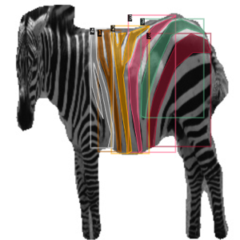
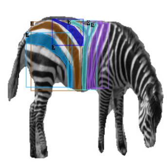
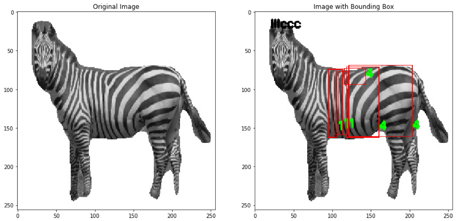
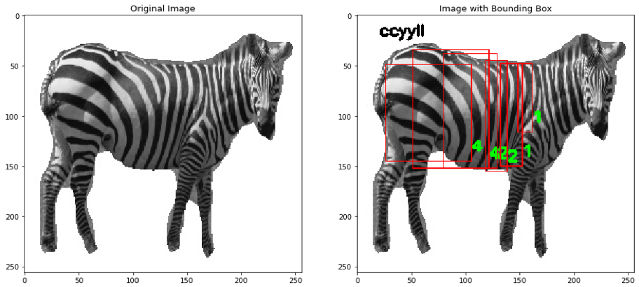

# ZebraRecognition
This projects aims to serve as a Proof of concept for recognizing zebras using their stripe pattern. Given a Zebra, the model aims at identifying the type of stripes on the zebra and encode the stripe information. The model uses an auxilary model to identify if the the image has left flank or the right flank of the zenra. This auxilary model uses a pretrained ResNet. The code for idetifying the left/right flank can be found [here](https://github.com/saiajaym/lrzebra). 

## Dataset
The dataset consists of 824 images of 47 zebras. About 130 of them have been labeled with one of the 5 classes with a total of 700 individual lables. Each class represents a particular shape of a  zebra stripe, for e.g., class L represents a L shpaed stripe. The distribustion of classes can be found below.

|class|Label denoted as|Number of Lables|
|-----|-----|----------------|
|L|1|150|
|Y|2|148|
|YYY(Branched Y)|3|53|
|C|4|282|
|Lambda|5|28|

Sample annotated images:

## Model: MaskRCNN

Our approach uses a pretrained MaskRCNN available in [detectron2](https://github.com/facebookresearch/detectron2) ([documentation](https://detectron2.readthedocs.io/#)]). The model is finetuned using the labeled data in supervised setting. The model achives 90% accuracy on stripe classification task and around 70% accuracy on Zebra recognition:

Sample output images:

The link to the dataset can be found [here](https://drive.google.com/drive/folders/1j9M1bdf-4iAdhumeld9IoX89IZ3f_89F?usp=sharing). The link to the labels can be found [here](label)
